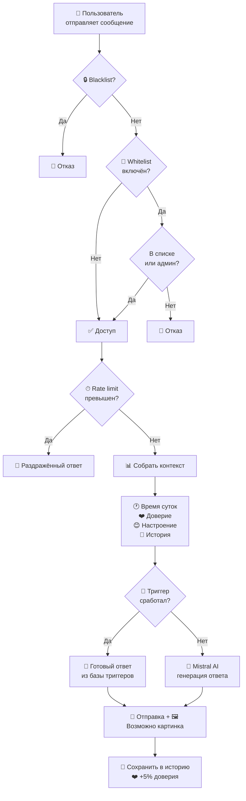

# 🎀 Анализ проекта «Махиро — Ролевой Telegram-бот»

---

## 📖 Что это и как работает

**Махиро** — это AI ролевой Telegram-бот, который играет роль персонажа **Махиро Ояма** из аниме «Onimai». Бот использует **Mistral AI** для генерации ответов от лица персонажа и никогда не выходит из роли.

### Архитектура (как сообщение проходит через бот)



### Ключевые модули

| Модуль | Файл | Что делает |
|--------|-------|-----------|
| **AI Client** | [mistral_client.py](file:///c:/Users/Luck1y/OneDrive/Desktop/bot_mahiro/ai/mistral_client.py) | Отправляет запросы к Mistral API |
| **Prompts** | [prompts.py](file:///c:/Users/Luck1y/OneDrive/Desktop/bot_mahiro/ai/prompts.py) | Строит system prompt с учётом времени, доверия, настроения |
| **Triggers** | [triggers.py](file:///c:/Users/Luck1y/OneDrive/Desktop/bot_mahiro/ai/triggers.py) | 5 категорий триггеров: мета, персонажи, внешность, активности, состояние |
| **Handlers** | [handlers.py](file:///c:/Users/Luck1y/OneDrive/Desktop/bot_mahiro/bot/handlers.py) | Обработка всех команд и сообщений + донаты через Stars |
| **Admin Panel** | [admin_panel.py](file:///c:/Users/Luck1y/OneDrive/Desktop/bot_mahiro/bot/admin_panel.py) | 1062 строки — inline-кнопки для управления ботом |
| **Mood System** | [mood_system.py](file:///c:/Users/Luck1y/OneDrive/Desktop/bot_mahiro/memory/mood_system.py) | 7 настроений, зависят от времени/сообщений/случайности |
| **Trust System** | [trust_system.py](file:///c:/Users/Luck1y/OneDrive/Desktop/bot_mahiro/memory/trust_system.py) | 0-100% доверия, влияет на поведение |
| **Long-Term Memory** | [long_term_memory.py](file:///c:/Users/Luck1y/OneDrive/Desktop/bot_mahiro/memory/long_term_memory.py) | Запоминает имя, факты, интересы, любимое аниме/игры |
| **Donations** | [donations.py](file:///c:/Users/Luck1y/OneDrive/Desktop/bot_mahiro/utils/donations.py) | Telegram Stars: донаты, балансы, топ, рефанды |
| **Web Admin** | [admin_panel_web.py](file:///c:/Users/Luck1y/OneDrive/Desktop/bot_mahiro/admin_panel_web.py) | FastAPI + Jinja2 — веб-дашборд для донатов |

---

## 🐛 Проблемы и баги в коде

### 1. Критические

> [!CAUTION]
> **Mistral API вызывается синхронно!**  
> В [mistral_client.py:45](file:///c:/Users/Luck1y/OneDrive/Desktop/bot_mahiro/ai/mistral_client.py#L45) используется `self.client.chat.complete()` (синхронный метод), а не `await self.client.chat.complete_async()`. Это **блокирует event loop** и при нескольких одновременных пользователях бот будет тормозить.

```diff
- response = self.client.chat.complete(
+ response = await self.client.chat.complete_async(
      model=self.model,
      messages=messages,
      temperature=TEMPERATURE,
      max_tokens=MAX_TOKENS
  )
```

> [!CAUTION]
> **Race condition при записи JSON** — если два пользователя одновременно пишут в бот, `_load → modify → _save` цикл может потерять данные. Особенно критично для [storage.py](file:///c:/Users/Luck1y/OneDrive/Desktop/bot_mahiro/memory/storage.py), [trust_system.py](file:///c:/Users/Luck1y/OneDrive/Desktop/bot_mahiro/memory/trust_system.py), [mood_system.py](file:///c:/Users/Luck1y/OneDrive/Desktop/bot_mahiro/memory/mood_system.py).

### 2. Логические ошибки

> [!WARNING]
> **Баг в mood_system.py:125-128** — проверка `> 50` никогда не выполнится, потому что `> 30` стоит первым:
> ```python
> if message_count_today > 30:       # ← сработает при 31
>     return "раздражённая"
> elif message_count_today > 50:     # ← НИКОГДА не сработает!
>     return "усталая"
> ```
> Нужно поменять порядок или использовать `>=`.

> [!WARNING]
> **`IMAGE_SEND_CHANCE = 1` в config.py** — это значит картинка отправляется в **100% случаев** (а не 15% как написано в README). Вероятно, хотели поставить `0.15`.

> [!WARNING]
> **Дублирование экземпляров** — `Statistics()`, `UserTracker()`, `MoodSystem()`, `TrustSystem()` создаются заново и в [handlers.py](file:///c:/Users/Luck1y/OneDrive/Desktop/bot_mahiro/bot/handlers.py#L29-L39) и в [admin_panel.py](file:///c:/Users/Luck1y/OneDrive/Desktop/bot_mahiro/bot/admin_panel.py#L23-L28). Каждый экземпляр имеет свой кэш, данные могут рассинхронизироваться.

### 3. Менее критичные

- **`from config import ...` внутри функций** ([handlers.py:48](file:///c:/Users/Luck1y/OneDrive/Desktop/bot_mahiro/bot/handlers.py#L48), [handlers.py:96](file:///c:/Users/Luck1y/OneDrive/Desktop/bot_mahiro/bot/handlers.py#L96)) — после `reload_config` эти импорты берут **старые** значения, потому что они уже были импортированы на уровне модуля в [filters.py](file:///c:/Users/Luck1y/OneDrive/Desktop/bot_mahiro/bot/filters.py#L4).
- **`load_dotenv()` вызывается многократно** внутри admin_panel callback'ов — лучше использовать `load_dotenv(override=True)` один раз.
- **Нет `pre_checkout_query` хендлера** — Telegram требует ответ на `PreCheckoutQuery` перед платежом, без него оплата не пройдёт.
- **ZIP бэкап включает `.env`** с токенами — это угроза безопасности.

---

## 🔧 Что можно улучшить

### Приоритет 1 — Критично

| # | Улучшение | Сложность |
|---|-----------|-----------|
| 1 | **Переход на async Mistral API** (`.complete_async()`) | 🟢 Легко |
| 2 | **Синглтоны для сервисов** — один экземпляр Statistics/Tracker/etc. | 🟢 Легко |
| 3 | **Добавить `asyncio.Lock`** для JSON-операций или перейти на SQLite/aiosqlite | 🟡 Средне |
| 4 | **Добавить `pre_checkout_query` хендлер** для Stars | 🟢 Легко |
| 5 | **Исправить баг с порядком спам-проверки** в mood_system | 🟢 Легко |

### Приоритет 2 — Улучшения функционала

| # | Улучшение | Описание |
|---|-----------|----------|
| 6 | **Кнопки-команды для пользователей** | Inline-кнопки или ReplyKeyboard вместо текстовых команд (подробнее ниже ↓) |
| 7 | **Мини-игры** | Камень-ножницы-бумага, угадай число, викторина по аниме |
| 8 | **«Махиро пишет первой»** | Периодические scheduled-сообщения по cron |
| 9 | **Голосовые сообщения** | TTS через API (ElevenLabs, gTTS) |
| 10 | **Обработка фото/стикеров** | Махиро реагирует на присланные картинки |
| 11 | **Система достижений** | «Первый разговор», «100 сообщений», «Друг Махиро» |
| 12 | **Графики статистики** | matplotlib/plotly → картинки с графиками в admin panel |
| 13 | **Автоматическое извлечение фактов** | AI сам определяет факты из разговора → long_term_memory |
| 14 | **Поддержка групповых чатов** | Махиро реагирует при упоминании или на `@bot_username` |

### Приоритет 3 — Архитектура

| # | Улучшение | Описание |
|---|-----------|----------|
| 15 | **Миграция на SQLite/aiosqlite** | Решит race conditions и масштабируемость |
| 16 | **Dependency Injection** | Передавать сервисы через middleware вместо глобальных экземпляров |
| 17 | **Конфиг-менеджер** | Класс для горячей перезагрузки конфига без `importlib.reload` |
| 18 | **Docker + docker-compose** | Для удобного деплоя |
| 19 | **Тесты** | Хотя бы базовые unit-тесты для триггеров и mood_system |
| 20 | **Webhook вместо polling** | Для продакшена эффективнее |

---

## 🌐 Про Web Admin Panel (UI)

### Текущее состояние

Сейчас есть **два** админ-интерфейса:

1. **Telegram Admin Panel** ([admin_panel.py](file:///c:/Users/Luck1y/OneDrive/Desktop/bot_mahiro/bot/admin_panel.py)) — **1062 строки**, полноценная панель через Inline-кнопки внутри Telegram. Работает хорошо, покрывает: статистику, пользователей, whitelist/blacklist, рассылку, экспорт, донаты, настройки.

2. **Web Admin Panel** ([admin_panel_web.py](file:///c:/Users/Luck1y/OneDrive/Desktop/bot_mahiro/admin_panel_web.py)) — **106 строк**, минималистичный FastAPI-дашборд. Показывает **только статистику донатов** + API для рефандов. Шаблон [admin.html](file:///c:/Users/Luck1y/OneDrive/Desktop/bot_mahiro/templates/admin.html) — базовый HTML без дизайна.

### Что можно сделать с Web Admin

> [!TIP]
> Web-панель сейчас очень базовая. Можно превратить её в полноценный дашборд:

**Вариант A — Расширить текущий FastAPI:**
- Добавить страницы: пользователи, настроения, доверие, whitelist/blacklist
- Добавить авторизацию через логин/пароль (сейчас только токен в URL)
- Красивый UI через шаблоны с CSS/JS
- Графики через Chart.js
- Управление ботом в реальном времени

**Вариант B — Полноценный SPA (Next.js / Vite + React):**
- REST API от FastAPI → React фронтенд
- Real-time обновления через WebSocket
- Полная админка: управление пользователями, настройка бота, просмотр логов
- Дашборд с графиками, аналитикой

**Мой совет:** Вариант A достаточен для твоего масштаба. Полноценный SPA — overkill для личного бота.

---

## 🎛 Кнопки для каждой команды в боте

### Ответ: ДА, можно! И это делается легко

В Telegram есть **3 способа** добавить кнопки для команд:

### Способ 1 — `ReplyKeyboardMarkup` (постоянные кнопки внизу чата)

Лучший вариант для пользовательских команд. Кнопки **всегда видны** внизу экрана:

```python
from aiogram.types import ReplyKeyboardMarkup, KeyboardButton

def get_user_menu() -> ReplyKeyboardMarkup:
    """Постоянное меню пользователя"""
    keyboard = [
        [KeyboardButton(text="😊 Настроение"), KeyboardButton(text="📊 Статистика")],
        [KeyboardButton(text="🎮 Мини-игра"), KeyboardButton(text="💫 Донат")],
        [KeyboardButton(text="🔄 Сброс"), KeyboardButton(text="❓ Помощь")],
    ]
    return ReplyKeyboardMarkup(keyboard=keyboard, resize_keyboard=True)
```

Результат — **постоянные кнопки** внизу чата, которые отправляют текст как обычное сообщение.

### Способ 2 — `InlineKeyboardMarkup` (кнопки под сообщением)

Для конкретных действий — как уже сделано в админ-панели и донатах:

```python
from aiogram.types import InlineKeyboardMarkup, InlineKeyboardButton

def get_start_menu() -> InlineKeyboardMarkup:
    """Меню при /start"""
    keyboard = [
        [InlineKeyboardButton(text="😊 Настроение", callback_data="user_mood")],
        [InlineKeyboardButton(text="📊 Моя статистика", callback_data="user_stats")],
        [InlineKeyboardButton(text="💫 Поддержать", callback_data="user_donate")],
        [InlineKeyboardButton(text="❓ Помощь", callback_data="user_help")],
    ]
    return InlineKeyboardMarkup(inline_keyboard=keyboard)
```

### Способ 3 — Menu Button (команды в меню бота)

Через BotFather или программно — кнопка «Меню» рядом с полем ввода:

```python
from aiogram.types import BotCommand

async def set_bot_commands(bot):
    """Устанавливает команды в меню бота"""
    commands = [
        BotCommand(command="start", description="🎀 Начать общение"),
        BotCommand(command="mood", description="😊 Настроение Махиро"),
        BotCommand(command="stats", description="📊 Моя статистика"),
        BotCommand(command="donate", description="💫 Поддержать"),
        BotCommand(command="balance", description="⭐ Баланс звёзд"),
        BotCommand(command="reset", description="🔄 Сброс диалога"),
        BotCommand(command="help", description="❓ Справка"),
    ]
    await bot.set_my_commands(commands)
```

### Рекомендация

> [!IMPORTANT]
> **Лучший вариант — комбинация всех трёх:**
> 1. **Menu Button** (способ 3) — для `/start`, `/help` и прочих стандартных команд
> 2. **ReplyKeyboard** (способ 1) — постоянные кнопки для популярных действий
> 3. **InlineKeyboard** (способ 2) — для вложенных меню (донаты, мини-игры)

Пример как это будет выглядеть:

```
┌──────────────────────────────┐
│  🎀 Махиро                    │
│                               │
│  Э-э… привет? 😳              │
│  Я Махиро… с кем я            │
│  разговариваю?                │
│                               │
│  ┌─────────┐ ┌──────────┐    │
│  │😊 Настр. │ │📊 Статист│    │
│  └─────────┘ └──────────┘    │
│  ┌─────────┐ ┌──────────┐    │
│  │💫 Донат  │ │❓ Помощь │    │
│  └─────────┘ └──────────┘    │
│                               │
│  ┌──────────────────────────┐ │
│  │😊 Настроение│📊 Стат │🔄│ │
│  └──────────────────────────┘ │
│  [Написать сообщение...    ]  │
└──────────────────────────────┘
```

---

## 📋 Итого: план действий

Если хочешь, я могу реализовать любую из этих улучшений. Вот мой рекомендуемый порядок:

1. ✅ **Исправить баги** (async Mistral, mood порядок, IMAGE_SEND_CHANCE)
2. ✅ **Добавить кнопки для команд** (ReplyKeyboard + Menu Button + Inline)
3. ✅ **Добавить `pre_checkout_query`** для корректной работы донатов
4. ✅ **Сделать синглтоны** для сервисов
5. 🔄 **Расширить Web Admin Panel** (красивый UI, больше страниц)
6. 🔄 **Добавить мини-игры / достижения**
7. 🔄 **Миграция на SQLite**

> [!NOTE]
> Скажи, что из этого списка тебе нужно реализовать — и я сделаю!
